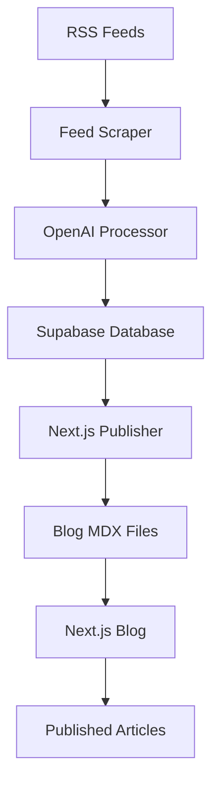

# 🪙 Crypto Feed Monorepo

A comprehensive crypto news aggregation system that scrapes RSS feeds, processes content with AI, and publishes to a Next.js blog.

## 🏗️ Architecture

This monorepo contains two main packages:

```
crypto-feed/
├── packages/
│   ├── scraper/          # RSS scraper & content processor
│   └── blog/             # Next.js blog frontend
├── docs/                 # Documentation
├── shared/               # Shared utilities (future)
└── package.json          # Root workspace config
```

### 📦 Packages

- **`@crypto-feed/scraper`** - Fetches RSS feeds, processes with OpenAI, stores in database
- **`blog`** - Next.js blog with Tailwind CSS, displays processed articles

## 🚀 Quick Start

### 1. Install Dependencies
```bash
# Install all packages
npm run install:all

# Or install individually
npm install                    # Root dependencies
cd packages/scraper && npm install
cd packages/blog && npm install
```

### 2. Setup Environment
Create `.env` file in the root:
```env
# Database
SUPABASE_URL=your_supabase_url
SUPABASE_ANON_KEY=your_supabase_key

# AI Processing  
OPENAI_API_KEY=your_openai_key
```

### 3. Run the System
```bash
# Start RSS scraper (runs continuously)
npm start

# Or run once and exit
npm run scraper:once

# Start blog development server
npm run dev:blog
```

## 📋 Available Scripts

### Root Scripts
| Script | Description |
|--------|-------------|
| `npm start` | Start RSS scraper service |
| `npm run dev:scraper` | Run scraper in dev mode |
| `npm run dev:blog` | Start Next.js blog dev server |
| `npm run build:blog` | Build blog for production |
| `npm run publish:nextjs` | Publish articles to blog |
| `npm run preview:nextjs` | Preview what would be published |
| `npm run install:all` | Install all dependencies |
| `npm run clean` | Clean all node_modules |

### Scraper Scripts (packages/scraper)
```bash
cd packages/scraper

npm start                    # Start RSS scraper service
npm run dev                  # Dev mode with nodemon
npm run once                 # Run once and exit  
npm run publish:nextjs       # Publish to Next.js blog
npm run preview:nextjs       # Preview publishing
```

### Blog Scripts (packages/blog)
```bash
cd packages/blog

npm run dev                  # Start dev server
npm run build                # Build for production
npm run start                # Start production server
npm run lint                 # Run linter
```

## 🔄 Workflow



1. **RSS Scraping**: Fetches articles from crypto news sources every 6 hours
2. **AI Processing**: OpenAI rewrites article snippets for better readability
3. **Database Storage**: Processed articles stored in Supabase
4. **Auto Publishing**: Articles automatically published to Next.js blog as MDX files
5. **Blog Display**: Next.js blog displays articles with proper SEO and styling

## 🛠️ Development

### Working with Scraper
```bash
cd packages/scraper

# Edit RSS feed sources
vim config/crypto-feeds.json

# Test specific functionality
node src/services/feedFetcher.js
node src/publishers/nextjsPublisher.js

# Run with options
node src/index.js --once
node scripts/publish-to-nextjs.js --preview
```

### Working with Blog
```bash
cd packages/blog

# Start dev server
npm run dev

# View at http://localhost:3000

# Articles are stored in:
data/blog/*.mdx
```

### Adding New Features

**New Scraper Service:**
1. Create file in `packages/scraper/src/services/`
2. Add to main class in `src/index.js`
3. Update package.json scripts if needed

**New Publisher:**
1. Create file in `packages/scraper/src/publishers/`
2. Follow existing patterns for database integration
3. Add CLI script if needed

**Blog Customization:**
1. Edit components in `packages/blog/components/`
2. Modify layouts in `packages/blog/layouts/`
3. Update config in `packages/blog/data/siteMetadata.js`

## 📁 File Structure

### Scraper Package
```
packages/scraper/
├── src/
│   ├── services/           # Core services
│   │   ├── feedFetcher.js    # RSS feed fetching
│   │   ├── database.js       # Supabase integration
│   │   └── openaiService.js  # AI content processing
│   ├── publishers/         # Content publishers  
│   │   ├── nextjsPublisher.js # Publish to Next.js
│   │   ├── markdownExporter.js
│   │   └── blogPublisher.js   # Generic blog publisher
│   ├── utils/              # Utilities
│   │   └── opmlParser.js     # OPML feed parsing
│   └── index.js            # Main aggregator class
├── scripts/                # CLI scripts
│   └── publish-to-nextjs.js
├── config/                 # Configuration files
│   ├── crypto-feeds.json     # RSS feed sources
│   ├── RAW.opml             # OPML feed list
│   └── supabase.sql         # Database schema
└── package.json
```

### Blog Package
```
packages/blog/
├── app/                    # Next.js 13+ app directory
├── components/             # React components
├── data/                   # Content & configuration
│   ├── blog/                 # MDX blog posts (auto-generated)
│   ├── authors/              # Author profiles  
│   └── siteMetadata.js       # Site configuration
├── layouts/                # Post layouts
├── public/                 # Static assets
└── package.json
```

## 🎯 Publishing Articles

### Automatic Publishing
Articles are automatically published when the scraper runs:
```bash
npm start  # Includes auto-publishing
```

### Manual Publishing
```bash
# Publish today's articles
npm run publish:nextjs

# Preview without publishing  
npm run preview:nextjs

# Publish with options
cd packages/scraper
node scripts/publish-to-nextjs.js --all-recent --limit 20
node scripts/publish-to-nextjs.js --category bitcoin
node scripts/publish-to-nextjs.js --force  # Republish existing
```

### Article Format
Published articles are saved as MDX files:
```yaml
---
title: "Article Title"
date: '2024-01-15'
tags: ['bitcoin', 'crypto', 'news']
draft: false
summary: "Article summary..."
images: ['featured-image.jpg']
authors: ['default']
layout: PostLayout
canonicalUrl: https://original-source.com
---

Article content with proper attribution...
```

## 🔧 Configuration

### RSS Feed Sources
Edit `packages/scraper/config/crypto-feeds.json`:
```json
[
  {
    "title": "CoinDesk",
    "xmlUrl": "https://www.coindesk.com/arc/outboundfeeds/rss/",
    "category": "news"
  }
]
```

### Blog Settings  
Edit `packages/blog/data/siteMetadata.js`:
```javascript
const siteMetadata = {
  title: 'Crypto News Hub',
  author: 'Your Name',
  headerTitle: 'Crypto Feed',
  description: 'Latest crypto news and analysis',
  // ... other settings
}
```

### Database Schema
Database setup is in `packages/scraper/config/supabase.sql`

## 🚨 Troubleshooting

### Common Issues

**"Module not found" errors:**
```bash
npm run clean
npm run install:all
```

**Database connection issues:**
- Check `.env` file has correct Supabase credentials
- Verify database tables exist (run `supabase.sql`)

**Blog not showing articles:**
- Ensure articles are published: `npm run publish:nextjs`
- Check `packages/blog/data/blog/` has MDX files
- Restart blog dev server: `npm run dev:blog`

**Publishing fails:**
```bash
# Check what would be published
npm run preview:nextjs

# Force republish  
cd packages/scraper
node scripts/publish-to-nextjs.js --force
```

## 📚 Documentation

- [`docs/NEXTJS_INTEGRATION.md`](docs/NEXTJS_INTEGRATION.md) - Detailed integration guide
- [`docs/OLD_README.md`](docs/OLD_README.md) - Original documentation
- [Next.js Blog Documentation](packages/blog/README.md)

## 🤝 Contributing

1. Follow the existing code structure
2. Add new services to appropriate packages
3. Update documentation for new features
4. Test both scraper and blog functionality

## 📄 License

MIT License - see LICENSE file for details

---

🚀 **Ready to aggregate some crypto news!**

Start with: `npm run install:all && npm start`