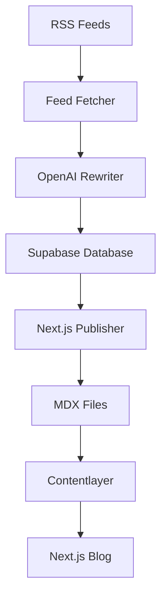

# Next.js Blog Integration

This integration automatically publishes crypto articles from your RSS feed aggregator to your Next.js blog.

## How It Works

1. **RSS Scraping** → Articles are fetched from crypto RSS feeds
2. **AI Rewriting** → OpenAI rewrites article snippets for better readability  
3. **Database Storage** → Processed articles are stored in Supabase
4. **Next.js Publishing** → Articles are converted to MDX format and written to `web/data/blog/`
5. **Auto-Detection** → Next.js Contentlayer automatically detects new blog posts

## Features

- ✅ **Automatic Publishing**: New articles are auto-published after RSS fetching
- ✅ **Duplicate Prevention**: Existing articles are skipped to avoid duplicates
- ✅ **SEO Optimization**: Auto-generated slugs, tags, and metadata
- ✅ **Image Support**: Featured images are included when available
- ✅ **Source Attribution**: Proper linking back to original articles
- ✅ **Tag Extraction**: Smart crypto-related tag detection
- ✅ **Contentlayer Compatible**: Works seamlessly with the Next.js blog structure

## Setup

### 1. Directory Structure
Make sure your Next.js blog is in the `web/` directory:
```
crypto-feed/
├── index.js                 # Main RSS aggregator
├── nextjsPublisher.js       # Next.js publisher (new)
├── publish-to-nextjs.js     # Standalone publisher script (new)
└── web/                     # Next.js blog
    └── data/
        └── blog/            # MDX blog posts go here
```

### 2. Install Dependencies
```bash
# Main directory - RSS aggregator dependencies
npm install

# Next.js blog dependencies  
cd web && npm install
```

### 3. Environment Setup
Make sure your `.env` file has database credentials:
```env
SUPABASE_URL=your_supabase_url
SUPABASE_ANON_KEY=your_supabase_key
OPENAI_API_KEY=your_openai_key
```

## Usage

### Automatic Publishing
The RSS aggregator now automatically publishes to Next.js after fetching articles:

```bash
# Run the aggregator (includes auto-publishing)
npm start

# Or run once and exit
node index.js --once
```

### Manual Publishing
Use the standalone publisher for more control:

```bash
# Publish today's articles
npm run publish:nextjs

# Preview what would be published (dry run)
npm run preview:nextjs

# Publish with custom options
node publish-to-nextjs.js --all-recent --limit 20
node publish-to-nextjs.js --category bitcoin --limit 5
node publish-to-nextjs.js --force  # Republish existing articles
```

### Starting the Next.js Blog
```bash
cd web
npm run dev
# Blog available at http://localhost:3000
```

## Publisher Options

| Option | Description | Default |
|--------|-------------|---------|
| `--preview` | Preview articles without publishing | false |
| `--today` | Only publish today's articles | true |
| `--all-recent` | Publish last 7 days of articles | false |
| `--limit N` | Maximum number of articles | 10 |
| `--force` | Republish existing articles | false |
| `--category X` | Filter by specific category | none |

## Generated Article Format

Published articles include:
- **Frontmatter**: Title, date, tags, summary, images, canonical URL
- **Content**: Featured image, article snippet, source attribution
- **Filename**: `YYYY-MM-DD-article-slug.mdx`
- **Tags**: Auto-extracted crypto terms + category
- **SEO**: Proper meta descriptions and structured data

Example output:
```yaml
---
title: "Bitcoin Hits New All-Time High"
date: '2024-01-15'
tags: ['bitcoin', 'crypto', 'trading', 'news']
draft: false
summary: "Bitcoin reaches unprecedented levels as institutional adoption continues to grow..."
images: ['https://example.com/bitcoin-chart.jpg']
authors: ['default']
layout: PostLayout
canonicalUrl: https://original-source.com/article
---


Bitcoin reaches unprecedented levels as institutional adoption continues to grow...

---

**Original Article:** [CoinDesk](https://original-source.com/article)

*This article was originally published on [CoinDesk](https://original-source.com/article) and has been curated for our readers.*
```

## File Organization

- Articles are saved as `YYYY-MM-DD-slug.mdx` in `web/data/blog/`
- Existing files are automatically skipped (use `--force` to override)
- Contentlayer rebuilds the site when new files are added
- Tags are automatically generated and counted

## Troubleshooting

### Blog Directory Not Found
```
Error: Blog directory not found: ./web/data/blog
```
**Solution**: Ensure Next.js blog is in the `web/` directory with proper structure.

### No Articles to Publish
```
No articles found to publish
```
**Solutions**: 
- Run RSS aggregator first: `node index.js --once`
- Check database has articles: Use your database client
- Try different time range: `--all-recent` instead of `--today`

### Articles Already Exist
```
Skipping existing article: 2024-01-15-bitcoin-hits-new-high.mdx
```
**Solutions**:
- This is normal behavior to prevent duplicates
- Use `--force` to republish: `node publish-to-nextjs.js --force`
- Delete existing files manually if needed

### Permission Errors
```
Error: EACCES permission denied
```
**Solution**: Check file/directory permissions for the `web/data/blog/` folder.

## Customization

### Modify Article Format
Edit `nextjsPublisher.js` → `articleToMdx()` method to customize:
- Frontmatter fields
- Content structure
- Tag extraction logic
- Filename format

### Change Publishing Logic
Edit `index.js` → `fetchAndStoreArticles()` method to modify:
- When auto-publishing occurs
- Publishing options
- Error handling

### Add Custom Fields
The Next.js blog supports additional frontmatter fields like:
- `bibliography`: For academic references
- `layout`: Different post layouts
- `lastmod`: Last modification date

## Integration Flow



The complete flow:
1. RSS feeds are fetched every 6 hours
2. Articles are filtered for today's content
3. OpenAI rewrites snippets for better quality
4. Articles are stored in Supabase database
5. **NEW**: Articles are automatically published to Next.js blog
6. Contentlayer detects new MDX files and rebuilds
7. Next.js blog displays new articles

## API Reference

### NextjsPublisher Class

```javascript
const publisher = new NextjsPublisher();

// Publish articles
await publisher.publishToNextjs(options);

// Preview articles  
await publisher.getPublishPreview(options);

// Clean up old articles
await publisher.cleanupOldArticles(30); // Keep 30 days
```

### CryptoFeedAggregator Methods

```javascript
const aggregator = new CryptoFeedAggregator();

// Publish to Next.js
await aggregator.publishToNextjs(options);

// Preview publishing
await aggregator.previewNextjsPublishing(options);
```

---

🎉 **You're all set!** Your RSS scraping system now automatically publishes to your Next.js blog.